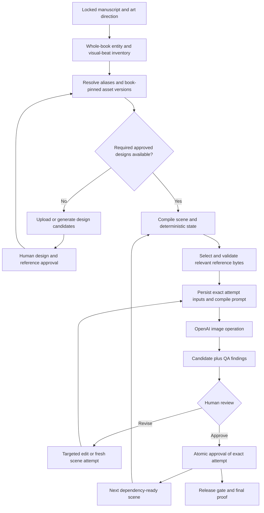

# Illustration consistency: code review and production design

Reviewed 2026-09-05 (America/Vancouver). This is the requested review before implementation.

**Recommendation: retain the studio's editorial workflow and add a small, enforceable visual-production layer. Approve recurring designs before final page generation wherever possible. Every production image must use explicit, approved, book-pinned visual references; every approval must identify exact pixels and inputs.**

The proposal's core principle is right. Its main weakness is treating visual references, model sheets, and targeted edits as stronger guarantees than they are. The application can guarantee which approved evidence reached the model and which output a person approved. It cannot guarantee that a new generation obeys every visual constraint. The production loop must catch and repair departures.

## 1. Current state and review scope

The working checkout is `main` at `2973e8ca82a0835b614812848e1d67a8999b224b`, containing only the initial README plus untracked Python caches. The actual studio is on the existing local branch `cursor/childrens-book-studio-b801` at **`37f50fd93fde00a6918425b638a9a34e580fab25`**, also present as its remote-tracking branch. The code references below are pinned to that commit. This review did not switch branches or modify production code or canon.

The repository describes a publishing studio operated by agents and Python utilities. It is not yet a running book-generation web application. There are no completed books or approved image assets in the reviewed tree. Character personalities have been partly populated; appearances and the series illustration style remain unresolved. See [Cove's visual rules][cove-rules], [Mars's visual rules][mars-rules], [visual style][style], and [character state][character-state].

| Stage | What exists | What actually executes |
| --- | --- | --- |
| Brief / book creation | YAML templates and numbered book directories | `create_book()` copies templates and registers the draft. [books.py][books] |
| Context | Relevant character text, canon summaries, values, style notes | `build_context()` creates a writing packet using character names and keyword selection. [context.py][context] |
| Story / page breakdown | Agent-authored outlines and spread-based manuscripts | Manuscript headings and editorial fields receive mechanical validation; story creation is an agent procedure. [AGENTS.md][agents], [quality_gates.py][gates] |
| Illustration direction | Structured YAML for cast, location, action, camera, props, clues, text space | Human/agent authored; no validated asset bindings or scene compiler. [art-direction.yaml][direction] |
| Image prompt / request | `IllustrationRequest`, separate generation and edit methods | A contract only. `get_provider()` always returns `UnconfiguredProvider`, which raises. [protocol.py][protocol] |
| Visual QA / approval | QA template, critic instructions, book approval string | Limited file checks and top-level QA result; no pixel-bound page approvals. [QA template][qa-template], [gates][gates] |
| Final book | Layout schema and assembly README | Assembly is explicitly not implemented. [assembly README][assembly] |
| Canon update | JSON story ledgers and proposed facts | `archive_approved()` writes prose facts after checking the book approval string. [canon.py][canon] |

Today, visual continuity principally depends on agents following written instructions, manually maintaining YAML, supplying reference files, and recognizing contradictions. It does **not** currently depend on an OpenAI conversation because there is no OpenAI integration. Nor is there an existing giant OpenAI prompt to optimize: prompt compilation is still missing.

The desired architecture is close in its **concepts and creative artifacts**, but most of its visual execution, storage, approval, and dependency guarantees remain to be built. An implementation-completeness percentage would be misleading.

## 2. What is already good

- **Keep the editorial process.** One owner of prose, independent criticism, manuscript lock, and pictures carrying additional story information are useful foundations. [AGENTS.md][agents]
- **Extend the art-direction template.** It already covers action, emotion, composition, focal point, recurring clues, and text space. These are essential to exceptional illustration, beyond merely keeping characters recognizable. [direction][direction]
- **Keep the distinction between persistent canon and temporary book state.** Make it executable and historical rather than replacing it with conversation memory. [visual-state template][state], [canon summary][canon-summary]
- **Keep the provider boundary.** Separate generation, editing, and QA are good public operations. Add validated inputs and a real provider factory. Do not replace the whole studio with a vendor-specific agent framework. [protocol][protocol]
- **Keep targeted writing packets and the curriculum separation.** They serve story development. Build a separate visual resolver instead of making the writing packet responsible for image identity. [context][context]
- **Keep the current QA categories and versioned candidate intent.** They need attempt-level persistence and explicit human approval. [visual QA agent][qa-agent], [illustration workflow][workflow]

## 3. Material findings and failure modes

### F1 — P0: illustration approval does not prove that the book has approved illustrations

`evaluate()` checks whether `art/direction.yaml` exists and reads one top-level `qa.result`. Missing QA produces a warning at approval; an unrecognized result also only warns. It does not verify the expected spread inventory, individual image files, reference gaps, review coverage, or hashes. A single top-level PASS can hide missing or failed spreads. A `visual_qa` failure can be bypassed through the same generic override machinery used for creative score judgments. [quality_gates.py:84][gates-art], [override handling:185][overrides]

**Change:** preserve an explicit manuscript/storyboard review mode, but introduce a separate illustrated-release gate. Require a locked manifest, every required illustration slot, a selected approved attempt for each, valid image bytes, current dependencies, and approval of the actual release pixels. Missing canon references and stale approvals are integrity errors, outside editorial score overrides. A human may explicitly accept a documented visual QA concern, but that is an attributable decision on the exact artifact.

### F2 — P0: approval and archive are not bound to the facts or images reviewed

`archive-book.py` preflights curriculum linkage, then calls `archive_approved()` without the approval-stage validator. That function checks only `human_approval == 'approved'`, then selects proposed items using `recommend_promote == 'yes'`. Editing those items after approval changes what is promoted. The advertised human-facing subset has no effective implementation: the `potential_new_canon` branch contains `pass`. No approval identifies a manifest revision, image hash, or individual visual asset version. [archive-book.py:33][archive], [canon.py:11][canon]

**Change:** approvals target immutable artifact revisions. Separate page approval, visual-design approval, and persistent story-fact promotion. Archive/export must call the same service-level integrity check as the UI, accept a release/approval ID, and promote only the explicitly approved item IDs. It must remain impossible for automated QA to create human approval.

### F3 — P0: there is no executable visual asset registry or approved-reference resolver

`IllustrationRequest` contains lists of paths and untyped dictionaries. There are no visual asset IDs, per-asset immutable versions, scoped aliases, reference approvals, provenance, or required-reference completeness checks. `IllustrationResult.version` is an output version, not an asset version. The `version: 1` fields in canon JSON are not per-asset visual history. Recurring elements and locations are prose entries. [protocol.py:21][protocol-request], [locations.json][locations], [recurring-elements.json][elements]

**Change:** create visual identity records that point to immutable approved image bytes. Add deterministic resolution before the provider call. A missing or ambiguous required asset must block production; no fallback to prose-only reconstruction.

### F4 — P0: temporary state is a mutable snapshot maintained by an agent

The template has one `as_of_spread`, mutable character/environment dictionaries, and a list of props. There is no reducer for persistent changes, per-scene snapshots, explicit removal/repair semantics, or dependency propagation. Rewriting the current YAML cannot reproduce what was supplied to an earlier spread. Instructions to expire state on approval risk confusing historical retention with exclusion from the next book. [visual-state.yaml:1][state], [art-director.md:64][art-state], [approve-book.md:21][approve-workflow]

**Change:** retain each book's state history forever. Exclude it from a new book's starting state unless explicitly carried forward. Compile changes into immutable scene snapshots; store state per physical instance, not just per design.

### F5 — P0: existing instructions permit unapproved pixels as downstream references

The Art Director may use the previous spread's approved **or latest** image. The workflow allows a QA-passed image into `art/approved/` before human review to obtain a stable continuity reference. The distinction from global canon is documented, but book-local design approval is missing. This permits a speculative robot design to spread through a book. [art-director.md:88][art-previous], [illustration-pipeline.md:24][workflow-review]

**Change:** approved asset references remain identity authority. Prior scene images are optional, exact approved attempts with explicit continuity roles. Block downstream production that needs an unapproved design. A directory name or QA PASS never establishes canon.

### F6 — P1: writing-context heuristics are unsuitable for visual identity

`_character_ids()` lowercases folder names, silently skips unknown names, and adds Cove and Mars to every packet. It does not resolve Eden to Mars or supporting family files to visual assets. `_character_slice()` excludes `visual-rules.md` for non-focus characters and can truncate included files. `_keyword_items()` can fall back to unrelated entries. These may be acceptable writing-context heuristics; they must not select authoritative image references. [context.py:93][context-ids], [context.py:130][context-slice], [context.py:242][context-keywords]

**Change:** resolve every visible subject independently of narrative focus, using explicit IDs or reviewed aliases. Preserve complete relevant invariants in the visual packet. Exclude absent characters and unrelated assets.

### F7 — P0: no OpenAI adapter, request compiler, or production provenance exists

Changing `config.yaml` alone cannot wire a provider: `get_provider()` does not read it. No OpenAI model, endpoint, fidelity parameter, or deprecated DALL-E request exists to migrate. Output requirements leave resolution unspecified; the pseudo-schema uses `format` while the dataclass uses `image_format`. No runtime schema validates that mismatch. [provider factory:105][provider-factory], [config][provider-config], [schema.yaml:11][image-schema], [protocol.py:14][protocol]

**Change:** implement one OpenAI adapter and typed request/compiler boundary; record requested and returned metadata. Keep provider capability validation separate from canon, continuity, and approval.

### F8 — P1: repeated archival can duplicate continuity, and writes can partially complete

The ledger replaces a book's entry, but timeline, locations, recurring elements, and threads append again on repeat archival. The seven canon updates run sequentially, and `write_json()` overwrites files directly. A crash can leave stores inconsistent. [canon.py:26][canon-writes], [timeline:103][canon-timeline], [locations:126][canon-locations], [io.py:46][json-write]

**Change:** make approval/export idempotent by immutable release ID. Treat existing story-canon JSON as maintained exports or use a recoverable transaction/journal for those writes. Do not spread the new visual workflow across independently writable files without a transaction boundary.

### F9 — P1: visual review, uploads, and final assembly are workflows, not an existing UI

There is no frontend, HTTP backend, upload handler, or interactive review implementation in the reviewed source tree. Reference folders support manual file placement, but no operation assigns or approves an uploaded image. Book assembly is a schema only. [reference instructions][cove-rules], [assembly README:18][assembly]

**Change:** one small local review application over the same Python services is sufficient. Do not assume existing components can be extended when those components are not present.

## 4. Corrections to the proposed architecture

**Design before final pages.** Scan the entire locked manuscript and visual direction for recurring or visually distinctive entities, including picture-only clues. Establish missing designs in preproduction. If a new robot is first noticed during page production, pause its dependents, propose an asset from that appearance, and obtain design approval. This fallback should not be the normal scheduling strategy.

**Approve the reference, not the idea of a reference.** A partly obscured robot can establish visible details. A generated side/rear view introduces unknown geometry. Keep source appearance, extracted view, generated reference candidate, and approved master distinct. Start with one readable approved master; add views only where useful. Never automatically bless a generated turnaround because its source page was approved.

**Keep stable identity throughout the lifecycle.** Allocate an asset ID once, including during candidate creation. Use a display label such as “Book 003 robot”; do not rename `TEMP_ROBOT_01` into a different database identity. Candidate/approved/rejected are review states; book/global is scope. “Book canon” means an approved version available to that book, not six more workflow statuses.

**Pin each book deliberately.** A new global Cove v4 must not silently change a book using Cove v3. Show “new version available.” An intentional migration of that book's binding marks current affected attempts stale; historical images, approvals, and published editions remain intact. Changing a preferred reference also changes an immutable input version. Use one asset-version number initially, with provenance distinguishing redesign from improved reference coverage.

**Make style an approved asset too.** Character identity alone does not control brushwork, texture, palette, edge treatment, or rendering detail. Use a reviewed series-style anchor and brief style rules. Keep a shared scale/relationship reference where relative size matters. These references need their own immutable versions and book bindings.

**Budget visual complexity.** Do not canonicalize every pebble. Preserve recurring/distinctive objects, costumes, constructions, and story clues. Choose a small relevant reference set. If essential references do not fit, reboard or simplify the scene; silently dropping the robot or one child is unacceptable. Treat dense model sheets and large casts as evaluation questions, not automatic improvements.

**Separate approval from aesthetic quality.** Reliable data can still produce stiff, repetitive illustrations. Preproduction needs a contact sheet showing close/wide rhythm, emotion, focal points, page turns, visual jokes, and text space. Approve a representative pilot before scaling to a full book.

## 5. OpenAI implementation review and current API findings

Official documentation was searched and opened during this review. The current image target remains **GPT Image 2**; the model page lists the dated snapshot **`gpt-image-2-2026-04-21`**. Prefer that documented snapshot for a book after an account-level smoke test. Record the exact requested ID; do not invent a returned backend revision if the response omits one. Snapshot selection is not pixel reproducibility. [OpenAI model documentation](https://developers.openai.com/api/docs/models/gpt-image-2)

The current guide says GPT Image 2 automatically uses high-fidelity image inputs; omit `input_fidelity`. It documents occasional identity/composition inconsistency and imprecise mask adherence. Size rules: both edges divisible by 16, maximum edge 3840, aspect ratio at most 3:1, total pixels 655,360–8,294,400; above 3,686,400 pixels is experimental. Complex requests may take about two minutes. These are API limits, not a quality guarantee. [Image-generation guide](https://developers.openai.com/api/docs/guides/image-generation)

The Python edit API accepts `image=[...]`: up to 16 PNG/WebP/JPG inputs, each under 50 MB. Transparent output for GPT Image 2 and its snapshot is preview functionality and requires PNG or WebP. Use a simple opaque background for initial master references. Current mask documentation differs between pages; for an initial masked-edit adapter, use the stricter documented PNG mask under 4 MB with the source dimensions, and verify through a live contract test. [Python edit reference](https://developers.openai.com/api/reference/python/resources/images/methods/edit)

The generation API supports `low`, `medium`, and `high` quality. GPT Image returns base64 image data; omit DALL-E-only `response_format` and `style` parameters, and do not use `hd`/`standard` quality. Persist decoded output bytes immediately. Explicitly set model, quality, size, and `output_format` in the adapter. [Generation API reference](https://developers.openai.com/api/reference/resources/images/methods/generate)

OpenAI's children's-book example generates a character anchor and supplies it to `images.edit()` for a new scene. The prompting guide emphasizes explicit image roles, preserved attributes, and limited iterative changes. Some other examples on that same page still include `input_fidelity="high"`; that conflicts with the GPT Image 2-specific API guide. Use the explicit model-specific rule and omit it. Do not copy sample requests blindly. [GPT Image prompting guide](https://developers.openai.com/cookbook/examples/multimodal/image-gen-models-prompting-guide)

**Recommended operation mapping** — these are application design decisions:

| Application operation | Provider operation | Required evidence |
| --- | --- | --- |
| Invent an unconstrained design | `images.generate()` | Design brief; output is a candidate |
| Invent a design within an approved series style | `images.edit()` if a style image is supplied | Style reference, clearly permitted invention |
| New scene with established cast/objects | `images.edit()` | Selected approved asset/style references; new composition instructions |
| Full regeneration of a page | `images.edit()` when established references exist | Same locked assets/state; new attempt; no required previous candidate |
| Targeted revision | `images.edit()` | Exact base candidate first, relevant canon references, structured changes |
| Clean master or model-sheet candidate | `images.edit()` | Approved source appearance/master; separate result approval |
| Visual QA | Separate vision-capable reviewer or human | Candidate plus exact references, manifest, state |

Do not route based merely on whether the operation is named `generate_illustration`: even an application's “new scene” is an API edit when image references are involved. Do not drop all established character references just because one newly introduced object needs invention.

Use the Image API for application-controlled image jobs. The Responses API remains useful for optional interactive refinement or structured scene proposals, but conversations must not become authoritative state. The guide distinguishes direct Image API model selection from Responses' mainline model plus image tool. [API overview](https://developers.openai.com/api/docs/guides/image-generation)

Keep `evaluate_illustration()` behind a separate reviewer implementation; GPT Image is not the component that should return the studio's structured QA report. Initially use human review and the existing Visual QA rubric. Automated review later produces findings and `unknown` results when evidence is insufficient, never human approval.

**Quality policy:** low for composition exploration, medium as the initial approval-candidate default, and high when pilot results justify it for masters, difficult subjects, or final scenes. Measure accepted images per attempt, review time, and cost per accepted spread. Changing quality or size creates new pixels requiring review. Do not automatically regenerate an approved medium image at high and label the replacement approved.

**Provider execution:** use a durable attempt/job row, bounded retries with backoff, request IDs, and a per-book cost/attempt limit. Retrying an uncertain timeout can incur another generation; record that uncertainty and never substitute a late result for an approved selection. Keep the job's input snapshot fixed across a transport retry. A creative retry is a new attempt. No paid image calls were made for this review, so account access, output quality, latency, and cost are not empirically established here.

## 6. Minimum data model

Use the existing Python codebase. For the local production/review service, one SQLite database plus immutable image files is sufficient; no separate registry service, vector database, or distributed workflow engine is needed. Existing YAML remains an authoring/import/export format; existing story canon remains a distinct domain. Do not make a database and editable YAML simultaneous competing authorities for visual approval.

The following are proposed logical records, not implemented repository models or ten mandatory tables before a pilot. Validated JSON can initially hold state snapshots, QA reports, manifests and reference lists. Keep a small set of transactional tables for assets/versions, books/scenes, attempts and approvals; normalize further only when needed.

| Record | Minimum fields and rules |
| --- | --- |
| `visual_assets` | Stable `asset_id`, `kind` (character, prop, vehicle, location, costume, style, etc.), name, scoped aliases, home scope, provenance. Never reuse an ID. Global promotion adds availability/provenance without breaking book references. |
| `visual_asset_versions` | `(asset_id, version)`, candidate/approved/rejected, immutable invariant notes, approved-reference set, master reference ID, source appearance, creator/import/generation provenance, approval ID. Approved content cannot be overwritten. |
| Reference entry within an asset version | `reference_id`, role (source appearance/master/view/sheet/style), view label, blob key, SHA-256, MIME, dimensions, optional source image/crop region. A source appearance is ineligible by default unless explicitly approved as a usable reference. |
| `book_visual_locks` | `(book_id, revision)`, pinned asset versions, style version, provider/model/quality policy/output settings, compiler version, planned layout, hash. Updating an active book creates a new revision. |
| `scenes` / `scene_revisions` | Scene row: stable ID, book ID, selected/approved attempt pointers and selection/approval revision. Immutable revision: manuscript hash, printed page mapping, instance-to-asset bindings, action/acting/camera/staging, required clues, state patches, reference needs and continuity source. |
| `state_snapshots` | Immutable snapshot ID, book ID, predecessor, source scene revision, canonicalized state payload/hash. Patches distinguish set, clear and transfer, with effective timing. |
| `generation_attempts` | Attempt ID, scene or asset candidate target, status, exact lock/scene/state revisions, operation, parent/base attempt, structured feedback, compiled prompt, compiler/schema version, request fingerprint, timestamps, provider metadata/errors, returned image key/hash. |
| `generation_inputs` | Attempt ID, ordered position, semantic role, asset ID/version/reference ID if applicable, exact blob/hash, source attempt/crop/transform if any. This is what was actually submitted. |
| `approvals` | Subject type/ID/revision/hash, decision, human actor, time, notes, expected input fingerprint and selection/approval revision. Page approval, asset approval and global promotion are different actions. |
| `qa_reports` | Attempt ID, target image hash, rubric/reviewer version, category findings, evidence/unknowns, recommendation. Separate from approvals. |

An image can depict multiple instances of one design: `robot_left` and `robot_right` can both use `ROBOT_01:v1`, with damage stored only on `robot_left`. Costumes are approved designs/bindings; whether a sleeve is rolled or a backpack is currently worn is temporary state.

An initial compiled scene, abbreviated for readability:

```json
{
  "scene_id": "BOOK_003_SPREAD_07",
  "revision": 2,
  "printed_pages": [14, 15],
  "book_lock_revision": 1,
  "instances": [
    {"instance_id": "cove", "asset_id": "CHAR_COVE_001", "version": 3},
    {"instance_id": "mars", "asset_id": "CHAR_MARS_001", "version": 2},
    {"instance_id": "robot", "asset_id": "BOOK_003_ROBOT_01", "version": 1},
    {"instance_id": "wrench", "asset_id": "BOOK_003_WRENCH_01", "version": 1}
  ],
  "location": {"asset_id": "LOC_WORKSHOP_001", "version": 2},
  "state_at_image": "STATE_003_07_IMAGE_R2",
  "state_after_scene": "STATE_003_07_AFTER_R2",
  "action": "Cove examines the bent antenna while Mars checks the tracks.",
  "camera": {"distance": "medium-wide", "height": "child eye level"},
  "required_clues": ["bent antenna clearly visible"],
  "continuity_source_scene": "BOOK_003_SPREAD_06",
  "include_previous_image": false
}
```

The repo uses **spreads**, normally 16 illustrations for 32 pages. Keep that production unit and map printed pages explicitly; do not accidentally generate 32 duplicate illustrations. The example page mapping is illustrative; the layout owns the actual mapping.

A state change is explicit, for example `set robot.damage.antenna = bent`, `set cove.dirt.left_knee = mud`, `transfer wrench from workbench to mars`, followed later by `clear cove.dirt.left_knee`. Repeating an unchanged property is unnecessary. Omission is not removal. Contradictory simultaneous ownership fails validation. State persists while an entity is offscreen.

Define both **state depicted in the image** and **state after the scene**, so a page showing a repair in progress does not ambiguously depict the completed repair. Support one linear narrative initially. Reject unexplained predecessor cycles and flag flashbacks/parallel timelines for explicit handling instead of silently equating page order with story time.

## 7. Pipeline and compiler changes



**Resolution:** let a text model propose entities from both manuscript and art direction, including visually recurring clues. Validate the proposal and review the book inventory once. Resolve explicit IDs first, then reviewed book bindings/aliases, then scoped global aliases. Multiple matches remain ambiguous. Unknown recurring entities enter a design queue; incidental untracked background detail is explicitly classified. Never silently pick the closest spelling or first match. Existing `Eden`/`Mars` and family names need reviewed alias records.

**Reference selection:** select approved readable views relevant to visible cast, props, and environment. Preserve approved style evidence in every production request, either a dedicated anchor or an approved identity reference explicitly serving both roles. Begin with an application target of roughly 3–6 inputs and measure results; this is a proposed working budget, not an OpenAI limit. Enforce the documented provider cap separately. A required reference cannot be dropped to meet a budget. One file may serve multiple explicit roles, but deduplicate bytes without losing role mappings. Record each selected view/crop, approval, hash and ordering.

Whole-page source references may contain other characters, lighting, damage and composition. Prefer an approved clear view or crop for identity; record any residual contamination. Inspect generated candidates for transferred background objects or accidental costume changes. The supplied files' order must match the prompt's image numbering. Verify hashes and decode images immediately before dispatch, not only when an asset was first registered.

**Previous-scene policy:** default off. Include an exact approved scene image only for a stated reason such as difficult temporary damage or environmental continuity. A previous-page reference never substitutes for a missing identity reference. It must not supersede computed current state. Its role explicitly prohibits copying the previous composition. When the image is absent, the persisted state still supplies continuity.

**Prompt compiler:** render a deterministic template from resolved data. Do not ask a second creative model to rewrite the canonical constraints on every attempt. Keep the full visual bible out of image requests. Separate visual identity, current state, scene-specific acting and composition, and series finish. Fail on unresolved requirements rather than hiding them in a negative prompt.

Example compiled structure (reference names and details here are hypothetical, not approved canon):

```text
PURPOSE
Illustrate spread 7 of this picture book.

SCENE AND ACTING
Cove examines the robot's bent antenna. Mars leans close to inspect its tracks,
looking curious and useful. The antenna is the story's focal detail.

REFERENCE ROLES
Image 1: Cove's approved identity and proportions.
Image 2: Mars's approved identity and proportions.
Image 3: the robot's approved construction and color placement.
Image 4: the workshop's permanent visual features.
Image 5: the approved wrench design.
Image 6: the series' approved paint texture and finish; no extra subjects.

CURRENT STATE
Cove's left knee is muddy. The robot's antenna is bent.
Mars carries the single wrench. Other lasting design details follow the masters.

PRESERVE
Each subject's approved identifying features and construction.
The approved Cove/Mars age and height relationship.
Recognizable permanent workshop features.

CHANGE FOR THIS SCENE
Pose, expression, framing and staging to show this action clearly.
Use a new child-height medium-wide composition.

COMPOSITION AND FINISH
Keep the focal action away from the gutter and the designated text area.
Follow the approved series finish while using this scene's planned lighting.

EXCLUSIONS
No unrequested characters, duplicated tools or rendered story text.
No unexplained design or costume changes.
```

For a targeted edit, preserve `base_attempt_id`, `change_requests[]`, `preserve[]`, optional mask hash, and parent lineage. Put the exact base image first and provide only the relevant canon images. Compile the requested deltas plus identity/state invariants; do not rerun a broad creative scene-writing prompt. Compare the entire result. If repeated edits drift, branch from the last good candidate instead of chaining indefinitely.

**Dependencies and stale results:** fingerprint the scene revision, effective state, ordered reference hashes/roles, the scene's selected asset/style bindings, global rendering settings, output settings, compiler version, and base image for edits. Retain the complete book-lock revision for provenance, but do not hash all unrelated book assets into every scene's validity check. Verify effective inputs at job dispatch, completion, human approval, and release. Recompute only descendants of changed state or actual selected visual dependencies. Unrelated scene/asset changes must not invalidate the whole book. A new global default alone does not change a pinned scene's fingerprint.

**Approval races:** approving attempt A must not approve later attempt B. Transactionally compare the exact attempt ID/output hash, `expected_scene_revision`, effective input fingerprint, and `expected_selection_revision` (a scene-row ETag). Increment that ETag whenever selection or approval changes. The selection check prevents an old browser approving A from replacing a newer approval of B even when both were generated from identical inputs. Late jobs remain historical candidates; they cannot overwrite the selected or approved attempt. “Approve & Continue” commits the exact approval, then schedules only eligible work. Workers receive generation permissions; human-review endpoints record approval actions separately.

**New assets during production:** stop the affected dependents, show the source appearance and a proposed asset, and request approval of a usable reference. A new clean-reference generation remains unapproved. “Do Not Preserve” is valid for an incidental; if later scenes still require the object, update those manifests or keep them blocked. Approving a page never silently approves every newly depicted object.

## 8. Smallest useful UX

Your three conceptual views are appropriate. They need not be three separate applications or a complex animation tool: one book workspace with a page list/detail panel and an asset drawer is enough.

| Surface | Visible by default | Actions |
| --- | --- | --- |
| Book review | Spread thumbnails, story snippet, Draft / Generating / Needs Review / Approved / Needs Revision; Blocked or Stale with a reason | Open spread; contact-sheet review; next ready spread |
| Spread detail | Story, candidate, actual reference thumbnails with role labels, effective state, new asset alerts | Approve exact candidate; Regenerate; Revise with Feedback; Approve & Continue |
| Asset drawer | Name/scope, source appearance, current approved master, candidate, version, first appearance, dependent spreads | Upload Reference; Approve Design; Revise Design; Generate Reference Sheet; Do Not Preserve; Promote to Global; View Dependencies |

Show prompt, raw manifest, generation settings, request ID and history in expandable details. Use derived Blocked/Stale badges over a small workflow status set, rather than several independent enums that disagree.

Manual upload creates a candidate with verified bytes, MIME, dimensions and hash; assignment identifies the asset. An explicit “Use this exact image as canon” action can upload and approve in one review transaction. Generated and uploaded images subsequently follow the same resolver and dependency checks. A replacement creates a version; it never overwrites approved bytes.

The final proof must use the approved attempt manifest, not whichever files currently match `art/approved/spread-*.png`. Include trim, gutter/bleed, text-safe boxes and output dimensions. Apply story text in layout. Pixel dimensions must meet the intended print size at the chosen print resolution; changing a DPI tag alone does not create detail. Approve the proof and any postprocessed final pixels.

## 9. Implementation plan with completion criteria

| Phase | Changes within this repository | Completion criterion |
| --- | --- | --- |
| 1. Visual contracts and storage | Add `scripts/studio/visual_assets.py`, `visual_store.py`, `visual_manifest.py`, `visual_approval.py`; versioned blob storage and SQLite migration; extend art-direction authoring template | Uploaded references can be explicitly approved; an exact asset version resolves to immutable bytes; stale/missing references cannot be approved or exported |
| 2. Resolver, state and compiler | Add `visual_resolver.py`, `visual_continuity.py`, `visual_prompt.py`; compile the existing direction template; book locks and request fingerprints | Robot/state scenarios pass offline; ambiguity, missing identity and required-reference overflow fail before any network call |
| 3. Provider and pilot | Extend existing `protocol.py`; implement `providers/openai.py`, configuration loading and durable attempts | Contract tests verify actual request fields and image bytes; a small real pilot demonstrates reviewable results under the account's limits |
| 4. Review and release integration | Small local review UI/API calling the same services; explicit upload/design/page approvals; extend `quality_gates.py`, archive and assembly integration | A user can approve a design, make two scenes, revise one and approve a release; stale browser views and late jobs cannot corrupt selection |
| 5. Production reliability and evaluation | Idempotent story-canon export, backups, repeatable visual stories, costs/attempt metrics, assisted QA and selected view tools | Repeatable review of a full mini-book and second-book reuse; new global versions do not alter a pinned book |

These module names are proposed additions. Keep the story, curriculum and editorial modules unless an integration requires a narrow change. Update the illustration workflow, Art Director/QA instructions, schema notes, and approval workflow alongside the code: their “latest image,” QA-as-approved, and state-expiry instructions would otherwise contradict the new guarantees.

Do not begin by building the complete dashboard or auto-generating every turnaround. The first end-to-end milestone is one approved asset, two distinct scenes using its exact reference, one temporary-state change, a targeted edit, and human approval tied to immutable outputs. It must work through a CLI/service path before elaborate UX.

## 10. Validation and repeatable evaluations

Existing tests cover manuscript shape, repository/context scaffolding and curriculum behavior. They do not exercise image requests, visual asset approval, state propagation, reference selection, or illustration dependencies. [test_studio.py:49][tests], [test_curriculum.py][curriculum-tests]

**Executed checks:** all 42 existing tests passed in a disposable export of the reviewed commit, using installed Python 3.14 and PyYAML 6.0.3. The unchanged tests needed a temporary-directory permission compatibility shim for this Windows sandbox; a plain run encountered permission errors. Nine assertion-backed reproduction cases then exercised the actual validator and archive CLI against disposable fixtures. The expected uppercase `FAIL` control correctly blocked approval; the remaining cases confirmed permissive/malformed QA handling, an override, or archive bypass. No source checkout or real canon was modified by those checks.

| Reproduction | Observed result |
| --- | --- |
| Missing QA, zero images | Approval passed with a warning |
| Top-level QA PASS, zero images, empty direction | Approval passed without warning |
| Lowercase `fail` or `PENDING` | Approval passed with warning |
| Top-level PASS with failed/missing image entry | Approval passed |
| Uppercase FAIL | Approval correctly failed; documented override allowed it |
| QA supplied as a nonempty list | Unhandled `AttributeError` |
| Archive fixture missing manuscript/editorial/art direction | Approval validation failed, but archive CLI returned success and updated the disposable ledger |

Evidence is preserved in [reproduction results](<C:/Users/AlexMcAulay/Claude/Cove+Mars/docs/review-evidence/repro-results.json>), [test log](<C:/Users/AlexMcAulay/Claude/Cove+Mars/docs/review-evidence/tests-compatible.log>), and [reproduction instructions](<C:/Users/AlexMcAulay/Claude/Cove+Mars/docs/review-evidence/README.md>). Separate exact-source in-memory probes also confirmed duplicate timeline/location entries on repeated archival; that additional result is not part of the nine-case file. No visual pilot or paid generation has been run; software tests cannot establish illustration quality.

Required mechanical tests:

1. Approved asset resolution yields approved, decodable, hash-verified reference bytes in the actual outgoing request.
2. Candidate, rejected, generated-sheet and uploaded-replacement references cannot become canon implicitly.
3. Scoped aliases resolve deterministically; ambiguous and unknown recurring subjects block production.
4. Every visible required asset is included; irrelevant subjects are excluded; required-reference overflow fails clearly.
5. Image role numbering, source order, transforms and hashes match persisted generation inputs.
6. Mud/damage survives intervening/offscreen scenes, clears only explicitly, and never mutates the canonical design.
7. Two instances sharing one asset retain independent state; a carried object cannot have two owners.
8. Adding global v2 leaves a v1-pinned book unchanged; intentional book migration identifies its affected current attempts.
9. Changed scene, state, approved reference, style, base image or settings prevents stale approval/release; unrelated changes do not.
10. Source-page approval never approves a derived master or unseen reference-sheet views.
11. Targeted edits preserve base attempt, structured feedback and lineage; full regeneration retains canonical references.
12. A late job cannot replace an approved image or a newer selected candidate; an old browser cannot replace a newer approval even for attempts with identical inputs; retries and repeated approval are idempotent.
13. Every illustrated-release slot has an approved exact final image; a top-level QA PASS cannot conceal missing/failed/unreviewed slots.
14. Missing/invalid QA, reference gaps and image hash changes fail appropriately; manuscript-only review remains possible through its explicit mode.
15. OpenAI adapter uses the pinned model, correct endpoint, supported parameters, valid dimensions and ordered real images; no `input_fidelity`, DALL-E fields, silent provider/model fallback, or text-only rescue for missing references.
16. Invalid responses, transient failures, cancellation, uncertain timeouts and quota errors retain previous approvals and diagnosable attempts.
17. Higher-quality regeneration and postprocessing cannot inherit approval of different pixels.
18. Archive/export rejects modified approved inputs and repeats without duplicate canon entries or partially committed release state.

Use synthetic fixtures and a fake provider for these tests. Add a small explicitly invoked live contract check and manual visual evaluation separately; ordinary CI should not incur image-generation costs.

| Visual story | What to inspect |
| --- | --- |
| A: five Cove/Mars scenes with different poses and distances | Faces, relative ages/scale, wardrobe, convincing acting and varied composition |
| B: introduce a robot, then reuse it across six scenes | Approved design preserved after occlusion, changing scale and viewpoint; no downstream generation before design approval |
| C: robot becomes muddy, remains offscreen, reappears, is cleaned | Correct state progression; canonical colors/geometry survive |
| D: redesign robot v1 to v2 | Existing book remains pinned; intentional migration lists correct dependents; old edition is recoverable |
| E: workshop from several camera angles | Recognizable permanent structure, spatial coherence and meaningful variation |
| F: second book with the same cast and series finish | Character and style continuity without importing first-book dirt or arbitrary costumes |
| G: crowded scene / conflicting reference / deliberate small edit | Reference-budget behavior; detected defects; unintended edits outside requested change |

Freeze manifests, approved assets, rubric and run settings for each evaluation. Compare several attempts per scenario against the same references and the previous production configuration. Record identity/asset/state/story correctness separately from aesthetics (composition, expression, texture, lighting, visual rhythm). A human reviews crop comparisons and full-book contact sheets. Automated QA may assist but cannot hide uncertain judgments behind a single score.

Choose acceptance thresholds from the pilot: require zero known identity or story-state errors in approved output, then measure rejection rate, edit rounds, time and cost per accepted spread. Do not use pixel-identical golden-image assertions for nondeterministic generations or claim a single successful example proves book-to-book consistency.

## 11. Remaining risks and explicit limits

- **Extraction can miss an important entity.** Inventory review and post-generation new-asset alerts catch omissions. Code can validate declared dependencies, not prove that every meaningful visual detail was declared.
- **References can conflict or be insufficient.** Approval must establish which view is authoritative. Hidden geometry remains unknown until designed and reviewed.
- **An image model can blend subjects, drift in style, or alter supposedly fixed pixels.** Whole-image review and reversible attempt history remain necessary. “Do not change” is direction, not an enforcement mechanism.
- **Style and design approval are still missing creative inputs here.** The application must allow useful candidate exploration without pretending Cove/Mars appearances or the series finish are already canonical.
- **Global improvements must preserve old books.** Keep approved editions and explicit per-book bindings; migrations are production choices.
- **A shared database is not enough if agents can rewrite its approval fields.** Give worker code candidate-generation operations; make human approval an explicit UI/service action with artifact revision checks. For a local single-user tool this can be simple, without enterprise identity infrastructure.
- **Reference-heavy requests may dominate cost.** Record actual usage and results. Avoid maximizing resolution, reference count or retry count by default.
- **Print quality is a separate validation step.** Assess the actual proof, crop, gutter, text placement and effective image resolution. A consistent preview is not automatically a finished book.
- **Official examples are not perfectly synchronized.** Keep a small model capability profile, SDK version and live smoke test. Document model-specific decisions instead of copying generic fields into every request.

## 12. Prioritized actions

**P0 — required before serious illustrated-book generation**

1. Work from the studio source branch, preserving the current checkout until implementation begins.
2. Establish approved series style and Cove/Mars master references; inventory and approve recurring book designs before final scenes.
3. Implement immutable asset versions/reference bytes, scoped resolution, book locks and instance state snapshots.
4. Implement the OpenAI adapter and deterministic reference-aware compiler with current model parameters and exact provenance.
5. Enforce human asset/page approvals tied to exact artifacts; block unapproved dependencies, stale attempts and incomplete illustrated releases.
6. Run the two-scene milestone and representative visual pilot; prove the pipeline can deliver reviewed consistent results before scaling.

**P1 — important for production reliability**

1. Build the small review workspace, manual upload flow, revision comparisons and contact-sheet review.
2. Add deliberate asset migrations and dependency invalidation, durable job/retry handling, cost limits and backup/recovery.
3. Make canon/archive writes idempotent and recoverable; integrate release checks and actual book proof assembly.
4. Run the repeated visual stories and track quality/cost per accepted spread on every material pipeline change.

**P2 — worthwhile later improvements**

1. Assisted visual QA, subject crops and view recommendations calibrated against human review.
2. Optional reviewed model sheets, expression/pose/wardrobe libraries and global-promotion convenience tools.
3. Parallel generation of genuinely independent scenes, advanced chronology, and conversational refinement over the same persisted records.

The operational standard is the user's: **the model creates pixels; the application owns identity, canon, state, continuity, approval and provenance.** Exceptional illustration additionally requires art direction, selection and review of the actual images.

[agents]: https://github.com/amac84/Storybook/blob/37f50fd93fde00a6918425b638a9a34e580fab25/AGENTS.md
[books]: https://github.com/amac84/Storybook/blob/37f50fd93fde00a6918425b638a9a34e580fab25/scripts/studio/books.py#L41
[context]: https://github.com/amac84/Storybook/blob/37f50fd93fde00a6918425b638a9a34e580fab25/scripts/studio/context.py#L30
[context-ids]: https://github.com/amac84/Storybook/blob/37f50fd93fde00a6918425b638a9a34e580fab25/scripts/studio/context.py#L93
[context-slice]: https://github.com/amac84/Storybook/blob/37f50fd93fde00a6918425b638a9a34e580fab25/scripts/studio/context.py#L130
[context-keywords]: https://github.com/amac84/Storybook/blob/37f50fd93fde00a6918425b638a9a34e580fab25/scripts/studio/context.py#L242
[gates]: https://github.com/amac84/Storybook/blob/37f50fd93fde00a6918425b638a9a34e580fab25/scripts/studio/quality_gates.py#L24
[gates-art]: https://github.com/amac84/Storybook/blob/37f50fd93fde00a6918425b638a9a34e580fab25/scripts/studio/quality_gates.py#L84
[overrides]: https://github.com/amac84/Storybook/blob/37f50fd93fde00a6918425b638a9a34e580fab25/scripts/studio/quality_gates.py#L185
[canon]: https://github.com/amac84/Storybook/blob/37f50fd93fde00a6918425b638a9a34e580fab25/scripts/studio/canon.py#L11
[canon-summary]: https://github.com/amac84/Storybook/blob/37f50fd93fde00a6918425b638a9a34e580fab25/scripts/studio/canon.py#L55
[canon-writes]: https://github.com/amac84/Storybook/blob/37f50fd93fde00a6918425b638a9a34e580fab25/scripts/studio/canon.py#L26
[canon-timeline]: https://github.com/amac84/Storybook/blob/37f50fd93fde00a6918425b638a9a34e580fab25/scripts/studio/canon.py#L103
[canon-locations]: https://github.com/amac84/Storybook/blob/37f50fd93fde00a6918425b638a9a34e580fab25/scripts/studio/canon.py#L126
[json-write]: https://github.com/amac84/Storybook/blob/37f50fd93fde00a6918425b638a9a34e580fab25/scripts/studio/io.py#L46
[archive]: https://github.com/amac84/Storybook/blob/37f50fd93fde00a6918425b638a9a34e580fab25/scripts/archive-book.py#L33
[direction]: https://github.com/amac84/Storybook/blob/37f50fd93fde00a6918425b638a9a34e580fab25/templates/art-direction.yaml#L10
[state]: https://github.com/amac84/Storybook/blob/37f50fd93fde00a6918425b638a9a34e580fab25/templates/visual-state.yaml#L1
[qa-template]: https://github.com/amac84/Storybook/blob/37f50fd93fde00a6918425b638a9a34e580fab25/templates/visual-qa.yaml#L1
[protocol]: https://github.com/amac84/Storybook/blob/37f50fd93fde00a6918425b638a9a34e580fab25/tools/image-generation/protocol.py#L14
[protocol-request]: https://github.com/amac84/Storybook/blob/37f50fd93fde00a6918425b638a9a34e580fab25/tools/image-generation/protocol.py#L21
[provider-factory]: https://github.com/amac84/Storybook/blob/37f50fd93fde00a6918425b638a9a34e580fab25/tools/image-generation/protocol.py#L105
[provider-config]: https://github.com/amac84/Storybook/blob/37f50fd93fde00a6918425b638a9a34e580fab25/tools/image-generation/config.yaml#L1
[image-schema]: https://github.com/amac84/Storybook/blob/37f50fd93fde00a6918425b638a9a34e580fab25/tools/image-generation/schema.yaml#L11
[workflow]: https://github.com/amac84/Storybook/blob/37f50fd93fde00a6918425b638a9a34e580fab25/workflows/illustration-pipeline.md#L13
[workflow-review]: https://github.com/amac84/Storybook/blob/37f50fd93fde00a6918425b638a9a34e580fab25/workflows/illustration-pipeline.md#L24
[art-state]: https://github.com/amac84/Storybook/blob/37f50fd93fde00a6918425b638a9a34e580fab25/.cursor/agents/art-director.md#L64
[art-previous]: https://github.com/amac84/Storybook/blob/37f50fd93fde00a6918425b638a9a34e580fab25/.cursor/agents/art-director.md#L88
[qa-agent]: https://github.com/amac84/Storybook/blob/37f50fd93fde00a6918425b638a9a34e580fab25/.cursor/agents/visual-qa.md#L12
[approve-workflow]: https://github.com/amac84/Storybook/blob/37f50fd93fde00a6918425b638a9a34e580fab25/workflows/approve-book.md#L21
[assembly]: https://github.com/amac84/Storybook/blob/37f50fd93fde00a6918425b638a9a34e580fab25/tools/book-assembly/README.md#L18
[style]: https://github.com/amac84/Storybook/blob/37f50fd93fde00a6918425b638a9a34e580fab25/bible/visual-style.md#L1
[cove-rules]: https://github.com/amac84/Storybook/blob/37f50fd93fde00a6918425b638a9a34e580fab25/characters/cove/visual-rules.md#L1
[mars-rules]: https://github.com/amac84/Storybook/blob/37f50fd93fde00a6918425b638a9a34e580fab25/characters/mars/visual-rules.md#L1
[character-state]: https://github.com/amac84/Storybook/blob/37f50fd93fde00a6918425b638a9a34e580fab25/canon/character-state.json#L1
[locations]: https://github.com/amac84/Storybook/blob/37f50fd93fde00a6918425b638a9a34e580fab25/canon/locations.json#L1
[elements]: https://github.com/amac84/Storybook/blob/37f50fd93fde00a6918425b638a9a34e580fab25/canon/recurring-elements.json#L1
[tests]: https://github.com/amac84/Storybook/blob/37f50fd93fde00a6918425b638a9a34e580fab25/tests/test_studio.py#L49
[curriculum-tests]: https://github.com/amac84/Storybook/blob/37f50fd93fde00a6918425b638a9a34e580fab25/tests/test_curriculum.py
